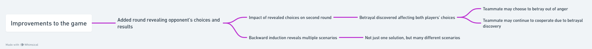

## Improvements to the game:

Added a round where you are able to see your opponent's choices as well as the results after the first round, without both players knowing about it beforehand, so you can get the most realistic results. For example, if you chose to betray your teammate in the first round, your betrayal will be discovered, which may affect both players' choices in the second round. For example, your teammate may choose to betray you out of anger at your betrayal, or your teammate may continue to cooperate with you out of the possibility that your betrayal has been discovered and therefore you may choose to cooperate. Then through backward induction we realize that there is not just one solution to the game, but many different scenarios, which helps us to get a full picture of how both sides of the Prisoner's Dilemma behave.

Reference:
@article{cooper1996cooperation,
  title={Cooperation without reputation: Experimental evidence from prisoner's dilemma games},
  author={Cooper, Russell and DeJong, Douglas V and Forsythe, Robert and Ross, Thomas W},
  journal={Games and Economic Behavior},
  volume={12},
  number={2},
  pages={187--218},
  year={1996},
  publisher={Elsevier}
}
